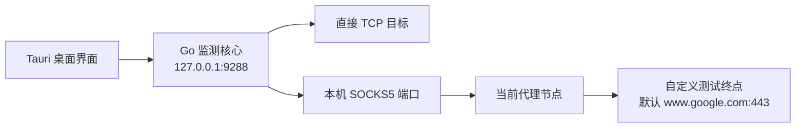

<p align="center">
  
</p>

<h1 align="center">链路哨兵（NetWatch）</h1>

<p align="center">
  一个轻量、本地优先的 TCP 与代理节点连接质量监测桌面应用。
</p>

<p align="center">
  <code>Windows</code> · <code>macOS</code> · <code>Tauri 2</code> · <code>React</code> · <code>Go</code>
</p>

## 项目简介

NetWatch 用于持续观察“这条连接现在到底稳不稳”。它既可以直接监测任意 `主机/IP + TCP 端口`，也可以通过代理客户端暴露的本地 SOCKS5 端口，测量“本机 → 代理节点 → 自定义测试终点”的完整 TLS 链路；节点测试终点默认是 `www.google.com:443`。

这里的“本地优先”是指桌面界面、配置、历史数据和监测 API 都留在本机，API 只监听 `127.0.0.1:9288`；探测任务本身当然会主动连接你配置的远端目标。项目没有为每次探测启动 `ping.exe`、curl 或 Node.js 子进程，实际网络探测由轻量 Go sidecar 直接使用 TCP Socket 完成。

NetWatch 适合以下场景：

- 长时间观察服务器 TCP 端口的可达性、延迟和波动情况；
- 比较 v2rayN 等代理客户端当前节点的真实连接体验；
- 区分本地代理、SOCKS5 隧道、TLS 握手和 HTTP 回包分别慢在哪里；
- 在后台低资源运行，并在需要时通过托盘快速打开监测面板。

> NetWatch 不是抓包工具。界面中的“丢包率”是基于一次完整连接是否成功，以及延迟是否出现明显尖峰得到的体验层估算，不等同于物理链路的包级丢包率。

## 核心功能

- 同时监测多个直接 TCP 目标和代理节点目标；
- 节点模式经过 `本地 SOCKS5 → 当前代理节点 → 自定义 TLS 终点`，默认使用 Google，不局限于 VLESS，也可用于 Hysteria2、Shadowsocks、Trojan 等任何能够提供本地 SOCKS5 入口的代理协议；
- 记录本地代理连接、SOCKS5 确认、TLS 首包、TLS 完成，以及可选的 HTTP 204；
- 实时显示当前延迟、平均延迟、P95、成功率、丢包率和波动率；
- Canvas 实时折线图支持 15 分钟、1 小时和 12 小时范围，目标卡片与图表同步切换；
- 支持深色与浅色主题一键切换，主题偏好保存在本机并在下次启动时恢复；
- 延迟尖峰以橙色圆点显示，连接超时或最终失败以红色三角显示；
- 对 DNS、路由、拒绝、SOCKS5、TLS、HTTP 等错误分别分类；
- 支持目标增删改、暂停、恢复和单独隐藏折线，配置自动保存；
- 启动桌面程序后直接进入监测页面，无需手动打开浏览器；
- 关闭窗口时可以选择最小化到托盘、退出监测或取消；
- 每个目标保留 900 个高精度样本，并以分钟摘要保留最多 12 小时历史；
- Go 核心与前端 API 固定绑定回环地址，不暴露到局域网。

## 工作方式



桌面程序 `NetWatch.exe` 负责窗口、托盘和生命周期管理；`NetWatch.Service.exe` 是实际创建探测 Socket 的 Go 监测核心。两者分离后，即使销毁 WebView 窗口进入托盘，定时探测也能继续运行。

## 快速开始

### 直接从源码构建并运行

需要提前安装：

- Node.js 22.13 或更高版本；
- Go 1.22 或更高版本；
- Rust stable；
- 当前平台对应的 [Tauri 2 系统依赖](https://v2.tauri.app/start/prerequisites/)。

在项目根目录执行：

```powershell
git clone https://github.com/EarunWu/NetWatch.git
Set-Location NetWatch
npm ci
npm run build
```

Windows 构建完成后，不安装也可以直接运行：

```powershell
.\src-tauri\target\release\NetWatch.exe
```

请保持同目录下的 `NetWatch.Service.exe` 与主程序放在一起。免安装运行要求系统已经安装 WebView2 Runtime。

Windows NSIS 安装包位于：

```text
src-tauri/target/release/bundle/nsis/
```

### 首次使用

1. 启动 `NetWatch.exe`，程序会自动启动监测核心并进入监测页面；
2. 首次运行会创建两个可删除的直接 TCP 示例目标；
3. 点击“添加目标”，选择“直接 TCP”或“节点探测”；
4. 选择时间范围后，折线图和目标卡片会同步显示该范围内的统计结果。

## 两种探测模式

### 直接 TCP 监测

填写目标主机或 IP、TCP 端口、探测间隔和超时。计时从 DNS 解析完成后、第一次 TCP Dial 开始，到 TCP 建连完成为止，因此界面延迟不包含 DNS 耗时。域名解析和后续 TCP 拨号分别拥有一个 `timeout_ms` 预算，所以极端情况下单轮墙钟时间可能接近两倍超时；同一域名解析出的多个地址共享 TCP 拨号阶段的预算，并按系统顺序依次尝试。

新建直接 TCP 目标默认开启“绕过 TUN”。NetWatch 会自动选择带默认网关且路由成本较低的物理网卡，也可以手动指定网卡；探测 Socket 会同时绑定网卡和对应本地地址。绑定失败会明确显示“绕过 TUN 失败”，不会退回可能产生约 `1 ms` 假延迟的普通 TUN 路径。升级前已经存在的目标默认保持关闭，可在编辑目标时逐个开启。

域名仍由系统 DNS 解析，DNS 耗时不计入 TCP 延迟。如果 v2rayN、Clash 等组件向系统 DNS 返回 FakeIP，物理直连无法使用该地址时会给出提示，此时应改填目标真实 IP。

### 代理节点探测

节点模式不解析 VLESS、Hysteria2 等协议配置，而是连接代理客户端提供的本地 SOCKS5 端口。填写：

- 节点名称：用于标记当前 SOCKS5 端口所对应的节点；
- 测试主机与 TLS 端口：默认 `www.google.com:443`，可以改成其他具有有效 TLS 证书的终点；
- SOCKS5 地址：仅允许本机回环地址，如 `127.0.0.1`、`localhost` 或 `::1`；
- SOCKS5 端口：以 v2rayN 或其他代理客户端显示的本地端口为准；
- HTTP 204：默认关闭，只在所选终点支持 `/generate_204` 时开启；
- 探测间隔：默认 5 秒，最低 2 秒；
- 总超时：默认 8 秒。

当前仅支持无需用户名和密码的 SOCKS5 入口。测试终点域名通过 SOCKS5 交给代理端解析，不使用本地 DNS；填写 IP 时使用对应的 SOCKS5 IPv4/IPv6 地址类型。默认在证书校验和 TLS 握手完成后记为成功，不发送 HTTP 请求；开启“继续验证 HTTP 204”后，才会请求所选终点的 `/generate_204` 并严格验证 204 响应。自定义 IP 只有在证书包含对应 IP SAN 时才能通过证书校验，通常更推荐填写域名。

每次探测都会建立新的内层 TCP/TLS 连接，不使用 HTTP Keep-Alive 或 TLS 会话缓存。部分代理核心可能在远端真正连通前就确认 SOCKS5 CONNECT，因此 SOCKS5 确认时间接近 1ms 并不代表完整节点延迟；TLS 首包和 TLS 完成更能反映真实链路。

一个普通本地 SOCKS5 端口通常只代表代理客户端当前选中的节点。切换节点后，已有目标的历史和动态延迟基准会混入前后两个节点；若希望统计完全隔离，应删除旧目标并新建目标，仅修改名称不会清空历史或基准。修改测试主机、TLS 端口、SOCKS5 入口或 HTTP 204 开关时，NetWatch 会自动清空该目标的历史和动态基准。若要同时监测多个节点，需要为每个节点提供独立的本地 SOCKS5 端口或代理客户端实例。

## 指标说明

### 节点链路阶段

下表中的各阶段数值都从本轮探测开始时累计计时，并不是相邻阶段之间的耗时差。

| 指标 | 计时终点 | 主要用途 |
| --- | --- | --- |
| 本地代理连接 | 成功连接本机 SOCKS5 | 诊断本机代理端口，约 1ms 通常正常 |
| SOCKS5 确认 | SOCKS5 CONNECT 被接受 | 诊断隧道建立，可能被代理核心提前确认 |
| TLS 首包 | 收到 TLS 握手阶段的首批远端字节 | 证明远端已经回包，最接近经代理的 tcping |
| TLS 完成 | 测试终点 TLS 握手完成 | 节点模式的默认主延迟与尖峰判断依据 |
| HTTP 204 | 收到测试终点的 HTTP 204 响应头 | 可选的完整应用层体验验证 |

节点折线图只显示 TLS 完成时间；启用 HTTP 204 不会改变延迟尖峰的判断终点。

### 丢包率

直接 TCP 和节点探测采用相同的体验层估算口径：

| 最终状态 | 含义 | 计入丢包率 |
| --- | --- | --- |
| `success` | 探测成功且没有超过动态尖峰阈值 | 仅分母 |
| `packet_loss` | 连接最终完成，但延迟明显偏离滚动基准 | 分子和分母 |
| `timeout` | 超时阈值内没有完成探测 | 分子和分母 |
| `refused` | 直接 TCP 对端明确拒绝连接 | 分子和分母 |
| `dns_error` / `no_route` | DNS 或路由失败 | 分子和分母 |
| `tun_bypass_error` | 未找到指定物理网卡、地址族不匹配或 Socket 绑定校验失败 | 分子和分母 |
| 其他错误 | SOCKS5、TLS、HTTP 或其他 Socket 错误 | 分子和分母 |

每个目标使用最近 30 次有效完成测量的中位数作为滚动基准，积累至少 10 次后启用尖峰判断。当本次延迟严格超过下面的阈值时，本轮记为一次推定丢包：

```text
动态阈值 = max（滚动基准 × 2，滚动基准 + 200ms）
```

直接 TCP 使用建连延迟，节点模式使用 TLS 完成延迟。每个计划周期只执行一次探测，不额外重试。尖峰的真实延迟仍保留在折线图中，并继续参与平均值、P95、波动率和后续基准计算，以便线路长期换路后逐步适应。

```text
丢包率 = 所有非 success 样本数 ÷ 全部样本数 × 100%
```

连接拒绝、配置错误或协议错误也代表“本轮不可用”，因此会被计入；延迟尖峰还可能来自队列拥塞、服务器负载或路由变化。该指标用于比较实际连接体验，不能替代 ICMP、TCP 重传统计或抓包分析得到的物理丢包率。

### P95 与波动率

- P95：95% 的有效延迟不高于该值；
- 波动率：延迟总体标准差除以平均值，再乘以 100%；
- 直接模式的 P95 和波动率都使用 TCP 建连时间；
- 节点模式的波动率始终使用 TLS 完成时间；P95 默认使用 TLS 完成时间，启用 HTTP 204 后则使用完整 HTTP 204 总延迟；
- 少于两个有效测量时，波动率显示为“—”；
- 超出 900 个原始样本覆盖范围后，P95 使用相对量化误差不超过 2% 的分钟分布摘要，并在界面显示“≈”。

## 图表与数据保留

目标卡片和折线图共用 15 分钟、1 小时、12 小时时间范围。每个目标在内存中保留最近 900 个高精度样本，较早数据按每分钟一个聚合桶保留最多 12 小时，从而避免 1 秒采样时保存数万条完整对象。

历史只存在内存中，服务退出或重启后会重新积累。分钟摘要可以准确合并次数、平均值和波动率，P95 使用稀疏直方图估算；仅对已经进入分钟摘要的较早历史，图中每个目标每分钟最多保留一个异常标记，因此同一分钟出现多次异常时只显示最后一次，但丢包率及其他统计计数仍然完整。近期的 900 个原始样本不会受到这一标记限制。

## 桌面运行与托盘

点击窗口关闭按钮时可以选择：

- **最小化到托盘**：销毁当前 WebView 窗口以释放界面资源，保留托盘和 Go 监测核心；
- **退出监测**：停止探测并正常关闭 `NetWatch.Service.exe`，然后退出桌面程序；
- **取消**：返回当前窗口，不改变运行状态。

正常运行时可以看到以下进程：

```text
NetWatch.exe                 Tauri 桌面窗口、托盘和生命周期管理
├─ NetWatch.Service.exe     Go 监测核心，创建实际探测 Socket
└─ msedgewebview2.exe       Windows WebView2 的渲染与网络辅助进程
```

WebView2 启动多个辅助进程属于正常的隔离模型。进入托盘后 WebView 窗口会被销毁，只留下轻量托盘进程与 Go 核心；通过托盘图标再次打开时会重建页面。

此前 Windows 11 实机测试中，托盘进程约占 `2.8 MB`，包含 3 个目标的 Go 核心约占 `16.2 MB`，后台合计工作集约 `19 MB`。面板打开时 WebView2 会占用更多内存，且会随 WebView 版本、系统和页面状态明显变化；这些数字只作为测试环境参考，不是固定上限。

## 配置与日志

Windows：

```text
%LOCALAPPDATA%\NetWatch\targets.json
%LOCALAPPDATA%\NetWatch\netwatch.log
```

macOS：

```text
~/Library/Application Support/NetWatch/targets.json
~/Library/Application Support/NetWatch/netwatch.log
```

配置使用原子替换写入；日志只记录启动、关闭和异常等低频信息，不记录每一次高频探测样本。重新构建、安装或免安装运行不会主动删除已有配置。

## v2rayN TUN 绕过

不需要再为 `NetWatch.Service.exe` 配置整进程 `direct` 路由。整进程规则会同时影响节点探测对本机 SOCKS5 端口的访问，而且部分 TUN 栈仍可能在本机提前完成 TCP 建连，使结果继续接近 `1 ms`。

请在直接 TCP 目标中开启“绕过 TUN”：

1. “自动选择”适合只有一个正常物理出口的设备；
2. 同时连接 Wi-Fi、以太网或多个出口时，可以指定具体网卡；
3. 指定网卡断开、地址族不匹配或 Socket 绑定失败时，目标会显示明确错误，不会切回 TUN；
4. 节点探测不使用这个开关，仍按原路径连接本机 SOCKS5，再由代理核心访问所选测试终点。

Windows 使用系统的按 Socket 出口接口选项实现，无需管理员权限、系统路由修改或额外后台服务。macOS 已保留对应实现并通过交叉编译检查，但当前尚未在 Mac 实机和 TUN 环境中验证。

## 开发与测试

启动桌面开发模式：

```powershell
npm ci
npm run desktop:dev
```

执行前端单元测试、TypeScript 类型检查和 ESLint：

```powershell
npm test
```

执行 Go 测试与静态检查：

```powershell
Push-Location service
go test ./...
go vet ./...
Pop-Location
```

构建当前平台的正式桌面程序和安装包：

```powershell
npm run build
```

`npm run build` 会依次构建前端、同步 Go 内嵌静态资源、执行 Go 测试、生成当前平台 sidecar，再交给 Tauri 打包。

Windows 配置在 `src-tauri/target/release/bundle/nsis/` 生成 NSIS 安装包；macOS 配置分别在 `bundle/macos/` 与 `bundle/dmg/` 生成 `.app` 和 `.dmg`。如果仍需要旧版“后台 EXE + 浏览器页面”兼容产物，可以执行：

```powershell
npm run build:legacy
```

兼容产物会写入 `outputs/`，不是桌面版的主要发布方式。Go API 与 sidecar 协议详见 [service/README.md](service/README.md)。

## 平台说明

### Windows

桌面版使用系统 WebView2，不随应用打包完整 Chromium。NSIS 安装包使用 `embedBootstrapper`：系统已有 Evergreen WebView2 Runtime 时直接复用，缺少时由安装器调用微软引导程序下载官方运行时。完全免安装运行前，需要自行确保系统已存在 WebView2 Runtime。

### macOS

macOS 使用系统 WKWebView，不需要 WebView2，最低系统版本为 macOS 12。正式 `.app`/`.dmg` 应在 Mac 上执行 `npm ci` 和 `npm run build`，并在对外分发前完成 Apple 签名与公证。

## 项目结构

```text
app/                 React 桌面监测界面
assets/              项目图标等通用资源
build/               前端同步、Go sidecar 与发布脚本
service/             Go 监测核心、API、内嵌页面和测试
src-tauri/           Tauri 桌面外壳、托盘与生命周期管理
src/                 React/Vite 入口
```

## 当前限制

- 丢包率是体验层估算，不是物理包级丢包率；
- 自定义节点终点必须支持 TLS 并提供可验证证书；HTTP 204 检测还要求 `/generate_204` 严格返回 204；
- SOCKS5 地址必须是本机回环地址，并且暂不支持用户名/密码认证；
- 当前桌面构建支持 Windows 和 macOS 的 x64/arm64，尚未提供 Linux 构建配置；
- 最多可以配置 100 个目标；直接 TCP 最低间隔为 500ms，节点模式最低间隔为 2 秒，超时范围为 100ms–60 秒；
- 本地 API 固定使用 `127.0.0.1:9288`，端口被占用时监测核心无法启动；桌面端使用单实例，并会在核心异常退出后最多自动重启 5 次；
- 监测历史只保存在内存中，服务重启后不会恢复；
- 同一个 SOCKS5 端口切换节点后，旧目标会混合切换前后的统计和动态基准；
- 项目具备 macOS 构建配置，但正式 Mac 发布包仍需在 macOS 上完成实机验证、签名与公证。
